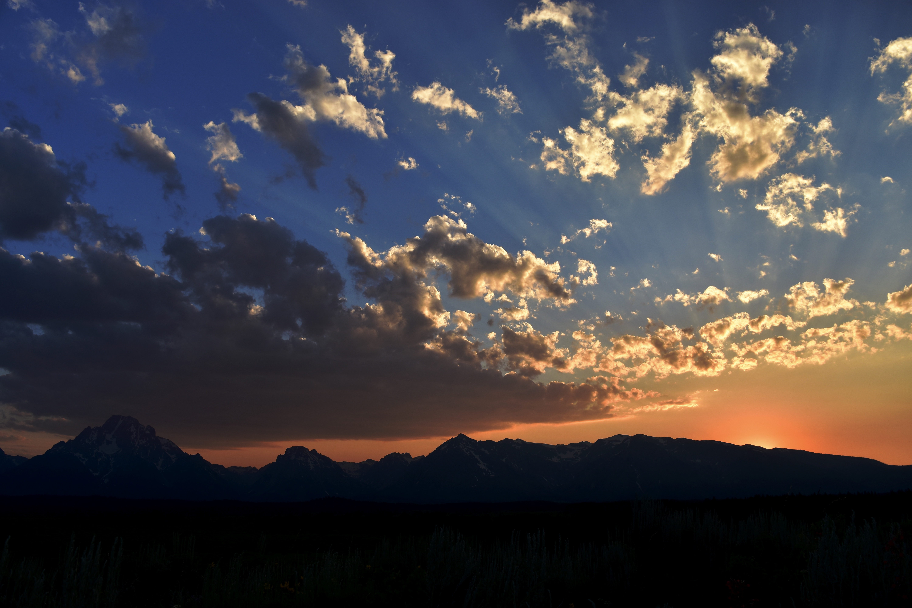
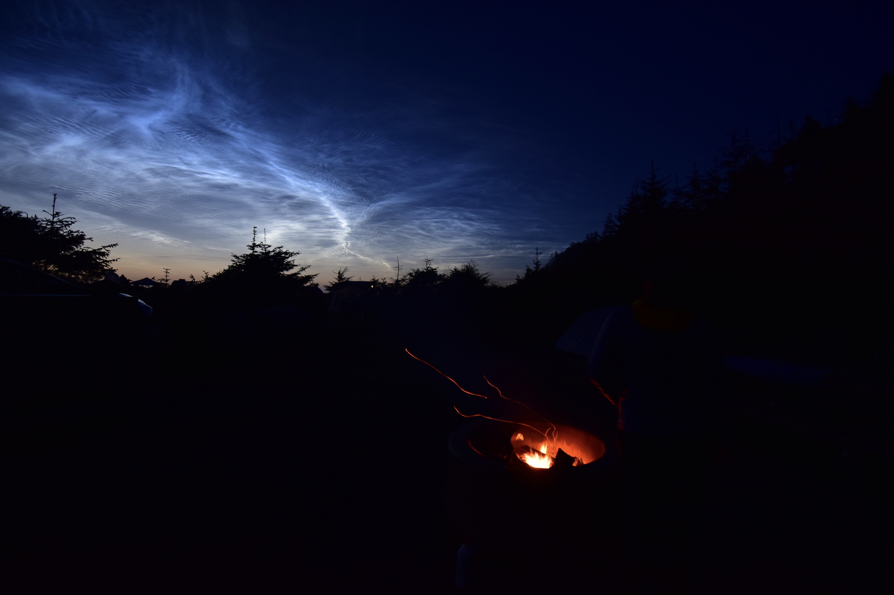
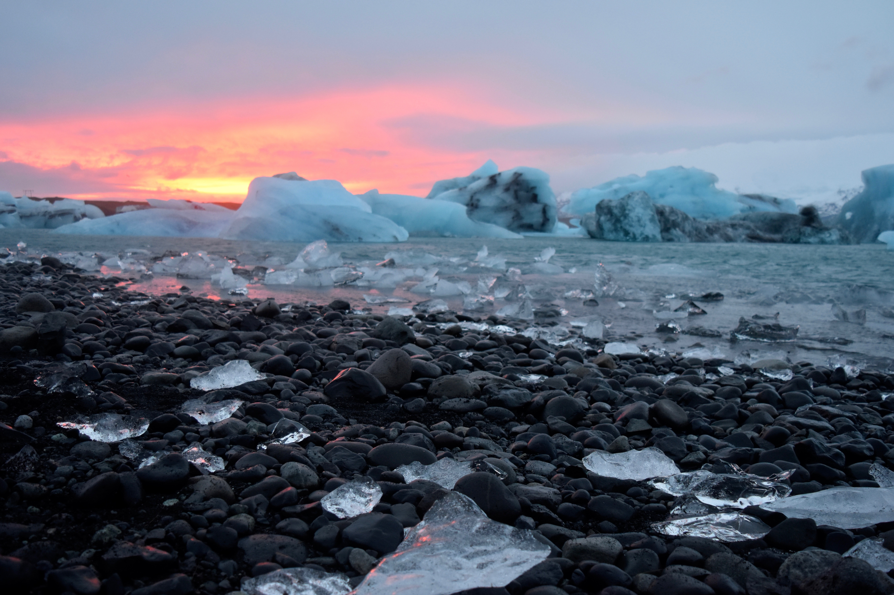
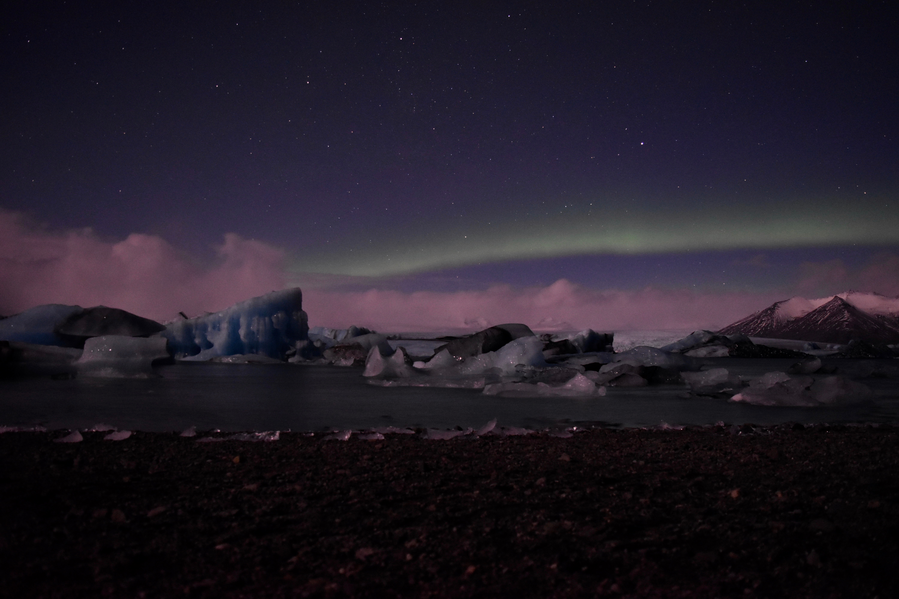

I'm still figuring out how to best use my camera ouside of "Auto" mode, but here are some photographs I've taken that I'm pretty proud of:
<body>

 
 
 

 
 
 

 
 
 

 
 
 

 
 
 

 
 
 

 
 
 

 
 
 

 
 
 

 
 
 

 
 
 

 
 
 

 
 
 

 
 
 

 
 
 

</body>